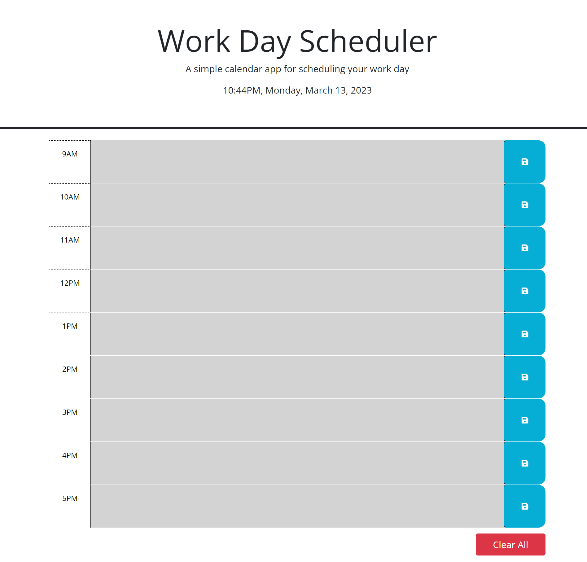

# Work Day Scheduler

## Description

This project was created to showcase knowledge of being able to incorporate and work with multiple JavaScript libraries (Day.js and jQuery) alongside being able to work with Bootstrap. It is a Work Day Scheduler that has a list of boxes corresponding to hours from 9AM to 5PM, representing an average work day, with the current date and time being displayed at the top of the page. The boxes are color-coded to represent their current status in the work schedule, grey being past, red being present, and green being future. This box updates as the hour changes. 

## Usage

Text may be typed in each box as a means to keep tasks organized for the current work day. The blue save icon on the right can be used to save the input for the corresponding box so that the data will be present on refresh. A clear all button is located at the bottom of the page that clears all tasks currently saved. This should mainly be used when a new work day begins or the current one ends and the tasks no longer need to be listed. Individual hours can be deleted by removing the text and saving the box.

Link to the scheduler itself:

https://kevrev.github.io/work-day-scheduler/

One can also view the index.html, script.js, and style.css files independently in the GitHub repository:

https://github.com/Kevrev/work-day-scheduler

## Credits

Jessica Wilkins from [freeCodeCamp](https://www.freecodecamp.org/news/javascript-split-a-string-string-to-array-js-method/) for her thorough explanation on the .split() function. It prevented me from having to find a more convoluted method or adding additional attributes to the time blocks that simply contained numbers (9, 10, 11, etc.). 
